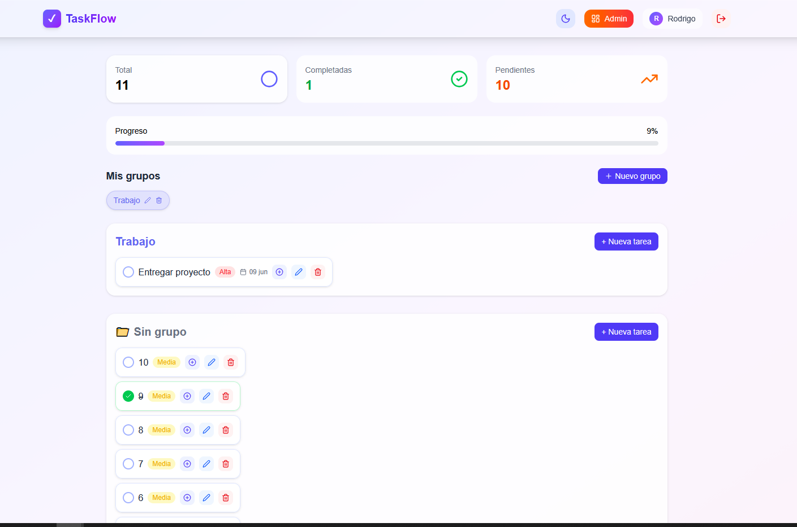
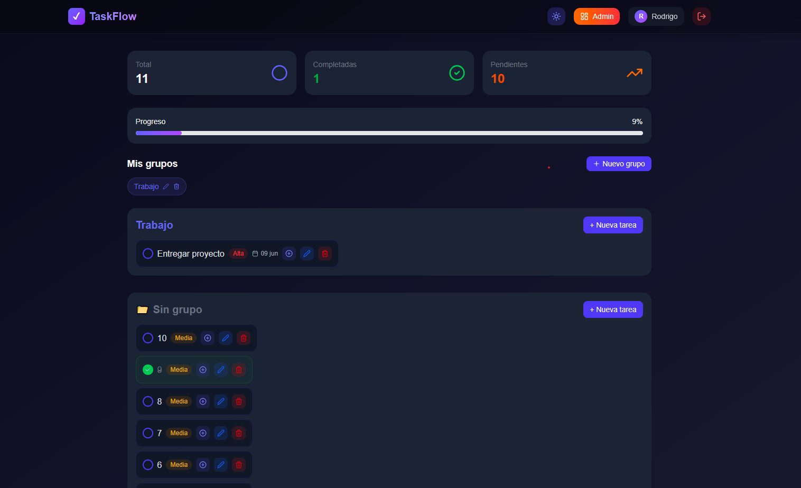
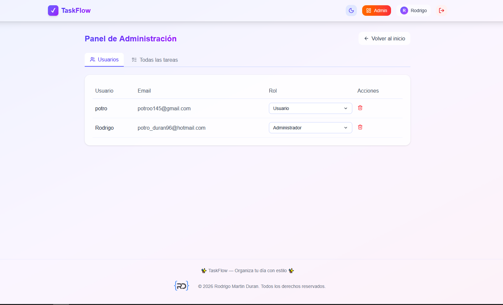
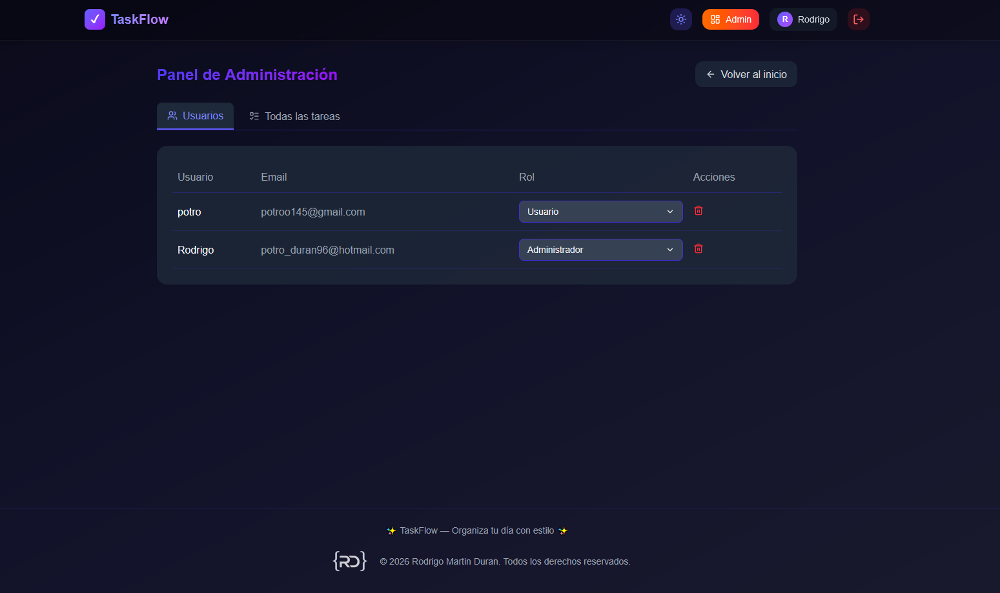
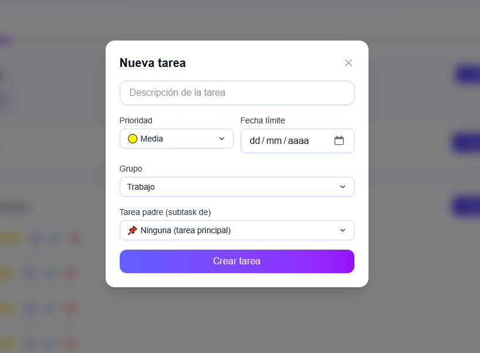
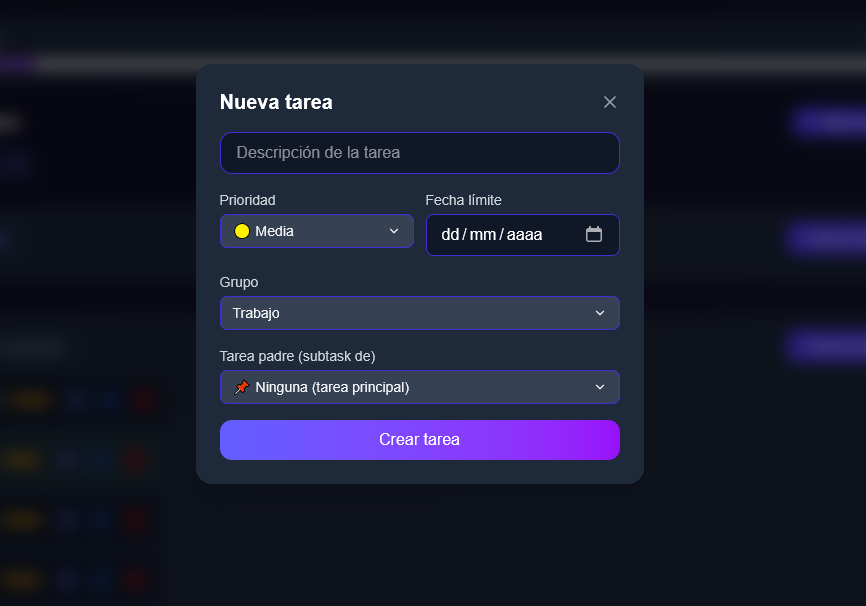

# 📝 TaskFlow


**Tu gestor de tareas moderno – grupos, subtareas, prioridades y modo oscuro**

🌐 [Demo en Vercel](https://taskflowdev.vercel.app) • 📦 [Instalación](#-instalación-local) • 🛠️ [Stack](#-stack-tecnológico) • ✨ [Features](#-características-principales)

---

## ✨ Características principales

| Módulo | Funcionalidades |
|--------|----------------|
| **🔐 Autenticación** | Registro / Login con JWT (cookies HttpOnly), protección de rutas, roles `user` / `admin`. |
| **📋 Tareas** | CRUD completo, prioridades (🟢 baja, 🟡 media, 🔴 alta), fechas límite, subtareas anidadas, orden personalizable. |
| **📁 Grupos** | Crea grupos con nombre y color, organiza tus tareas por áreas (Trabajo, Casa, Estudio…). |
| **👑 Panel de Admin** | Listado de usuarios (cambiar roles, eliminar), vista global de todas las tareas, paginación. |
| **🎨 Interfaz** | Modo oscuro/light persistente, diseño glassmorphism, responsive (mobile first). |
| **🔒 Seguridad** | Cookies HttpOnly, validación de datos, cifrado de contraseñas (bcrypt), CORS configurado. |

---

## 🛠️ Stack tecnológico

### Backend
- **Node.js** + **Express**
- **MongoDB** (local o Atlas) + **Mongoose**
- **JWT** + **bcryptjs** + **cookie‑parser**
- **dotenv**

### Frontend
- **React 18** + **Vite** (rápido)
- **Tailwind CSS** v4 (estilos personalizados)
- **React Router** v6
- **Lucide React** (iconos)
- **date-fns** (formateo de fechas)
- **axios** (peticiones HTTP)

### Herramientas adicionales
- **ESLint** + **Prettier** (código limpio)

---

## 🚀 Demo en vivo

👉 **Frontend:** [https://taskflowdev.vercel.app](https://taskflowdev.vercel.app)  

👉 **Backend:** [https://taskflowapi-zeta.vercel.app](https://taskflowapi-zeta.vercel.app)

---

## 📦 Instalación local

### Requisitos previos
- Node.js (v18 o superior)
- npm o yarn
- MongoDB (local o cuenta en MongoDB Atlas)

### Pasos

1. **Clona el repositorio**
   ```bash
   git clone https://github.com/RodrigoDuran14/todoapp.git
   ```
2. **Configura el backend**
   ```bash
   cd backend
   npm install
   cp .env.example .env   # edita con tus credenciales
   ```
   Ejemplo de `.env`:
   ```env
   PORT=5000
   MONGO_URI=mongodb://localhost:27017/taskflow
   JWT_SECRET=supersecretkey
   ```

3. **Configura el frontend**
   ```bash
   cd ../frontend
   npm install
   cp .env.example .env   # ajusta VITE_API_URL si es necesario
   ```
   Ejemplo `.env`:
   ```env
   VITE_API_URL=http://localhost:5000
   ```

4. **Ejecuta en modo desarrollo**
   - Backend: `cd backend && npm run dev` (puerto 5000)
   - Frontend: `cd frontend && npm run dev` (puerto 5173)

5. **Abre** `http://localhost:5173` y comienza a organizar tus tareas.

---

## 📸 Capturas de pantalla

| Modo claro | Modo oscuro |
|------------|-------------|
|  |  |

| Panel de administración | Panel de administración Dark |
|------------------------|----------------------------|
|  |  |

| Vista de form tareas | Vista de form tareas Dark|
|------------------------|----------------------------|
|  |  |

---

## 🧪 Endpoints principales (API)

| Método | Endpoint | Descripción | Acceso |
|--------|----------|-------------|--------|
| POST | `/api/auth/register` | Registrar usuario | público |
| POST | `/api/auth/login` | Iniciar sesión | público |
| GET | `/api/auth/me` | Obtener usuario actual | user |
| POST | `/api/todos` | Crear tarea (admite `groupId`, `parentId`, `priority`, `dueDate`) | user |
| GET | `/api/todos` | Listar tareas del usuario (admin ve todas) | user/admin |
| PUT | `/api/todos/:id` | Actualizar tarea | user/admin |
| DELETE | `/api/todos/:id` | Eliminar tarea | user/admin |
| GET | `/api/admin/users` | Listar usuarios (paginado) | admin |
| PUT | `/api/admin/users/:id/role` | Cambiar rol | admin |
| DELETE | `/api/admin/users/:id` | Eliminar usuario | admin |
| GET | `/api/admin/todos` | Listar todas las tareas (paginado) | admin |

---


## 📧 Contacto

**Autor** – Rodrigo Martin Duran  
✉️ Email: potro_duran96@hotmail.com  

🐙 GitHub: [@RodrigoDuran14](https://github.com/RodrigoDuran14)  

🔗 Linkedin: [@RodrigoDuran14](https://www.linkedin.com/in/rodrigoduran14)  

🌐 Portfolio: [rodrigodurandev.vercel.app](https://rodrigodurandev.vercel.app)

 ---

<div align="center">
  <sub>Hecho con 💜 y ☕. ¿Te gusta el proyecto? ¡Dale una ⭐ en GitHub!</sub>
</div>
